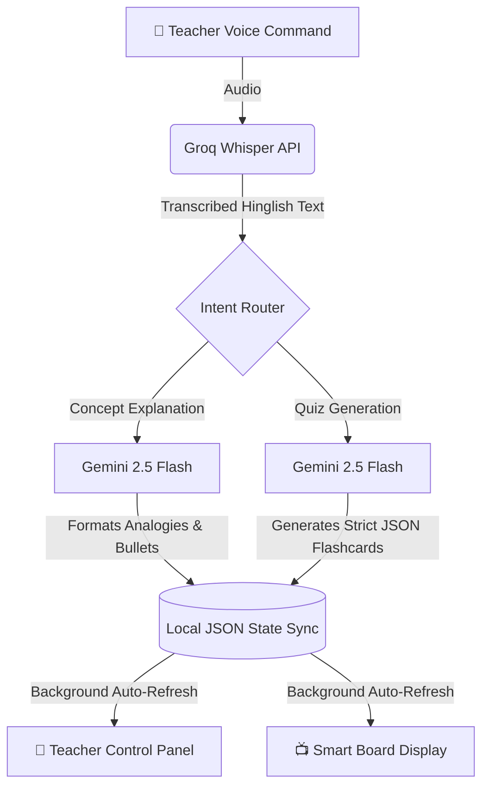

# 🏫 AI Classroom Co-Pilot: Voice-Enabled Teaching Assistant

[](https://www.python.org/)
[](https://streamlit.io/)
[](https://ai.google.dev/)
[](https://groq.com/)

A low-latency, dual-screen AI Teaching Assistant designed for government schools. It allows teachers to navigate lessons, simplify concepts into conversational Hinglish, and generate interactive quizzes completely hands-free.

### 📚 Explanation Mode (Side-by-Side)


### 📝 Quiz Mode & Teacher Answer Key


---

## 🎯 The Problem & The Solution
In noisy, fast-paced classrooms, teachers cannot be tethered to a keyboard or mouse. **AI Classroom Co-Pilot** solves this through a dual-device architecture:
1. **The Smart Board (`?view=student`):** Acts as a clean, distraction-free "dumb display" at the front of the room.
2. **The Teacher Remote (`?view=teacher`):** The teacher's mobile phone acts as a voice-activated remote control, complete with secret answer keys and instant navigation buttons.

---

## ⚙️ System Architecture




## 🚀 Key Features

### 1. Omni-Channel Voice Control & Smart Routing
* **Browser-Native Audio:** Captures audio directly from the browser using a custom floating microphone interface.
* **Intent Routing:** Automatically routes the AI to "Explanation Mode" or "Flashcard Mode" based purely on the intent of the teacher's voice command.

### 2. Native Hinglish Translation Engine
* Utilizes **Few-Shot Prompting** to force the LLM to output perfect conversational Hinglish using the Roman alphabet (e.g., *"Gravity sabhi objects ko ground ki taraf pull karti hai"*).
* Bypasses the clunky, robotic translations typical of smaller models, creating a natural, relatable teaching voice.

### 3. Enterprise-Grade Guardrails
* **Domain Isolation:** Strictly programmed to answer only educational topics. 
* **Auto-Rejection:** If a student or ambient noise triggers a non-educational or inappropriate phrase, the system instantly rejects it with a standardized message to protect the classroom environment.

### 4. Zero-Latency UI Synchronization
* Built using Streamlit's innovative `@st.fragment` architecture to allow background refreshing. 
* The Smart Board updates instantly from the Teacher's phone without dimming the screen, freezing the app, or requiring a full browser tab reload.

---

## 🛠️ Tech Stack

* **Frontend & State Management:** Python, Streamlit, HTML/CSS (Premium Glassmorphism EdTech UI)
* **Ears (Speech-to-Text):** Groq API (`whisper-large-v3`) for sub-second, highly accurate audio transcription.
* **Brain (LLM Engine):** Google GenAI SDK (`gemini-2.5-flash`) for high-speed, complex JSON generation and linguistic formatting.

---

## 💻 How to Run Locally

### Prerequisites
* Python 3.10+ installed on your machine.
* Free API keys from [Groq](https://console.groq.com/) and [Google AI Studio](https://aistudio.google.com/).


### Installation Steps

1. **Clone the repository:**
   ```bash
   git clone [https://github.com/Jayan-Shah/SmartBoard-VoiceAgent.git](https://github.com/Jayan-Shah/SmartBoard-VoiceAgent.git)
   cd SmartBoard-VoiceAgent
   ```

2. **Set up a Virtual Environment:**
   ```bash
   python3 -m venv venv
   source venv/bin/activate  # On Windows use: venv\Scripts\activate
   ```

3. **Install dependencies:**
   ```bash
   pip install -r requirements.txt
   ```

4. **Configure Environment Variables:**
   Create a `.env` file in the root directory and add your secret keys:
   ```env
   GROQ_API_KEY=your_groq_api_key_here
   GEMINI_API_KEY=your_gemini_api_key_here
   ```

5. **Launch the Application:**
   ```bash
   streamlit run app.py
   ```

### 📺 Viewing the Interfaces

* **Smart Board:** Open `http://localhost:8501/?view=student` on your primary monitor or classroom projector.
* **Teacher Remote:** Open `http://localhost:8501/?view=teacher` on your mobile phone, tablet, or secondary screen.

---

## 🎤 Live Demo Script

Want to test it out? Click the microphone on the Teacher Panel and try these commands:

1. **Test Concept Explanation:** *"Assistant, baccho ko Newton's laws samjhao."*
2. **Test Quiz Generation:** *"Assistant, friction par ek quiz generate karo."*
3. **Test Safety Guardrail:** *"Assistant, ek romantic gaana sunao."* *(Watch the AI safely block the request!)*

---
*Developed for the Connecting Dreams Foundation AI Challenge.*


